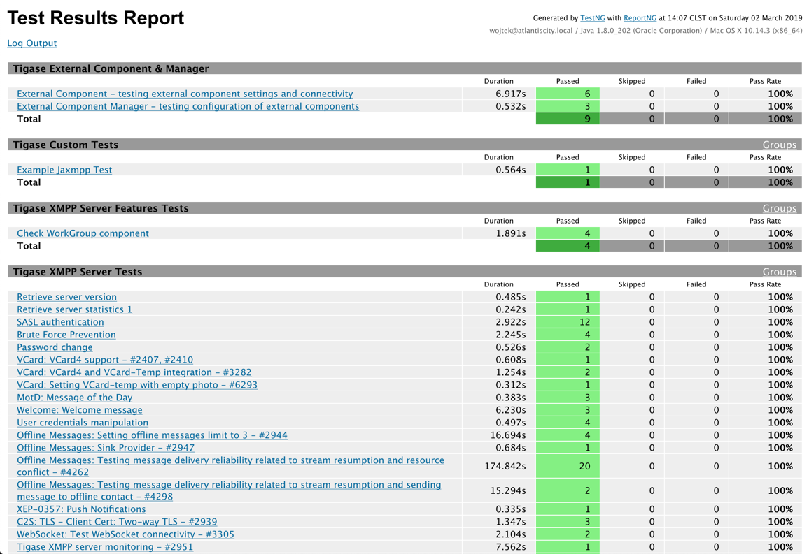

 /statusIcon)

# Tigase TTS-NG

XMPP funcional test framework with sizeable suite of tests based on the [jaxmpp2](https://github.com/tigaseinc/jaxmpp) and TestNG framework as a successor of [tigase-testsuite](https://github.com/tigaseinc/tigase-testsuite)

Current results for Tigase XMPP Server can be found on our pages: [Stable](https://build.tigase.net/tests-results/tts-ng/) and [Snapshot](https://build.tigase.net/nightlies/tts-ng-tests/) releases

# Features

* Over 200 funcional XMPP tests:
  * Core XMPP
  * MultiUserChat
  * PubSub
  * MAM
* Easy, automatic operation
* Easy way to add more tests
* (Optional) Downloading latest release of Tigase XMPP Server
* (Optional) Automatic preparaion of the database, supports:
  * MySQL
  * PostgreSQL
  * Derby
  * MongoDB
  * MS SQL Server

# How to Start

## Running

The whole suite execution can be handled via `$ ./scripts/tests-runner.sh` shell script. Executing it without any parameters will yield help:

```bash
$ ./scripts/tests-runner.sh
Run selected or all tests for defined server
----
  --all-tests [(database)] :: Run all available tests
          (database) is an array, if database is missing tests will be run against all configured ones
                     possible values: derby, mysql, postgresql, sqlserver, mongodb
  --custom <package.Class[#method]]> [(database)] :: Run defined test, accepts wildcards, eg.:
          --custom tigase.tests.util.RetrieveVersion
  --help :: print this help
----
  Special parameters only at the beginning of the parameters list
  --debug|-d                   Turns on debug mode
  --skip-rebuild-tts|-srb      Turns off rebuilding TTS-NG and only runs already build tests
  --skip-summary-page-get|-sp  Turns off automatic generation of Summary Page
  --download-latest|-dl        Turns on downloading latest Tigase Server release
  --reload-db|-db              Turns on reloading database
  --start-server|-serv         Turns on starting Tigase server
-----------
  Other possible parameters are in following order:
  [server-dir] [server-ip]
```

You should copy `scripts/tests-runner-settings.dist.sh` to `scripts/tests-runner-settings.sh` and adjust settings before running.

## Adding new tests

The easiest way to add new test is to extend `tigase.tests.AbstractTest` ([AbstractTest.java](https://github.com/tigaseinc/tigase-tts-ng/blob/master/src/test/java/tigase/tests/AbstractTest.java)), take a look at [ExampleJaxmppTest.java](https://github.com/tigaseinc/tigase-tts-ng/blob/master/src/test/java/tigase/tests/ExampleJaxmppTest.java) to get general idea:

```java
package tigase.tests;

import org.testng.annotations.Test;
import tigase.jaxmpp.j2se.Jaxmpp;
import tigase.tests.utils.Account;

import static org.testng.Assert.assertTrue;
import static tigase.TestLogger.log;

public class ExampleJaxmppTest
		extends AbstractTest {

	@Test(groups = {"examples"}, description = "Simple test verifying logging in by the user")
	public void SimpleLoginTest() {

		try {
			log("This is test case");

			Jaxmpp contact = getAdminAccount().createJaxmpp().setConnected(true).build();

			assertTrue(contact.isConnected(), "contact was not connected");

			if (contact.isConnected()) {
				contact.disconnect();
			}

			Account createUserAccount = createAccount().setLogPrefix("test_user").build();
			Jaxmpp createJaxmpp = createUserAccount.createJaxmpp().build();
			createJaxmpp.login(true);

			assertTrue(createJaxmpp.isConnected(), "contact was not connected");

		} catch (Exception e) {
			fail(e);
		}
	}
}
```


# Support

When looking for support, please first search for answers to your question in the available online channels:

* Our online documentation: [Tigase TTS-NG Docs](https://docs.tigase.net/tigase-tts-ng/master-snapshot/Tigase_TTS-NG_Guide/html/)
* Our online forums: [Tigase Forums](https://help.tigase.net/portal/community)
* Our online Knowledge Base [Tigase KB](https://help.tigase.net/portal/kb)

If you didn't find an answer in the resources above, feel free to submit your question to either our 
[community portal](https://help.tigase.net/portal/community) or open a [support ticket](https://help.tigase.net/portal/newticket)

# Compilation 

It's a Maven project therefore after cloning the repository you can easily build it with:

```bash
mvn -Pdist clean install
```

# License

This is official <a href="https://tigase.net/">Tigase</a> Repository.
Copyright (c) 2013-2019 Tigase, Inc.

Licensed under AGPL License Version 3. Other licensing options available upon request.
